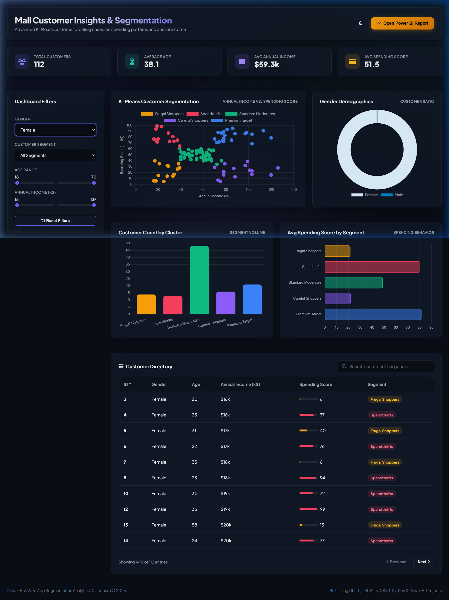

# Mall Customer Segmentation & Analytics Dashboard

An end-to-end customer analytics project utilizing the classic **Mall Customers dataset**. This project applies **K-Means Clustering** to segment customers into distinct behavioral personas and implements two highly interactive dashboards: a native **Power BI Desktop Report** and a premium, modern **Web Application**.

## 📊 Dashboard Preview



---

## 💡 Customer Segments Identified (K-Means Clustering)
Using the demographic and spending profile data, customers are segmented into 5 distinct groups:
1. **Premium Target Customers**: High Annual Income & High Spending Score (ideal group for luxury promotions).
2. **Careful/Conservative Shoppers**: High Annual Income & Low Spending Score (conservative spenders, highly affluent).
3. **Standard/Moderate Shoppers**: Average Annual Income & Average Spending Score (moderate/middle-of-the-road spenders).
4. **Spendthrifts/Impulsive Shoppers**: Low Annual Income & High Spending Score (active buyers with budget constraints).
5. **Frugal/Sensible Shoppers**: Low Annual Income & Low Spending Score (frugal, value-conscious buyers).

---

## 🚀 Key Features

### 1. Premium Interactive Web Dashboard
A highly-polished glassmorphic analytics interface loaded with premium BI controls:
- **Interactive Scatter Plot**: Plots Annual Income vs. Spending Score. Dots are color-coded by their segment and have rich details displayed in hover tooltips.
- **KPI Metrics Deck**: Dynamically calculated KPIs (Total Customers, Avg Age, Avg Income, Avg Spending) with count-up animations.
- **Advanced Slicers**: Filter the entire dashboard in real-time by Gender, Segment, Age Range, and Income Range.
- **Searchable Customer Directory**: A responsive table featuring pagination, instant search, and header-based sorting.
- **Theme Switcher**: Instant switching between Dark Theme (default) and Light Theme.
- **Desktop Launcher**: Integration to launch the companion Power BI Report directly from the web interface.

### 2. Native Power BI Desktop Report (.pbip)
A programmatically generated Power BI Project file featuring:
- Injected Tabular Model (TMDL) **DAX Measures** for all key aggregates.
- Interactive slicers, metrics cards, segment bar/column charts, and a details table.
- Direct connectivity to the local segmented CSV file.

---

## 🛠️ Project Structure
- `Mall_Customers.csv` - Raw customer dataset.
- `segment_customers.py` - Python script running K-Means clustering and generating segmented data.
- `create_powerbi_dashboard.py` - Compiles the Power BI `.pbip` project and maps the schema/visuals.
- `CustomerSegmentationDashboard/` - Power BI Project folder containing the report and semantic model definition files.
- `index.html` / `style.css` / `app.js` - Web application front-end files.
- `run_server.py` - Python local server hosting the web application and exposing launch hooks.

---

## 🏃 Getting Started

### Prerequisites
Make sure Python 3.10+ and standard dependencies are installed:
```bash
pip install pandas scikit-learn powerbpy
```

### Steps to Run:

#### Option A: Launch the Web Dashboard (Recommended)
1. Run the local Python server launcher:
   ```bash
   python run_server.py
   ```
2. A browser tab will automatically open to `http://localhost:8080`.
3. Inside the web app, click the **Open Power BI Report** button in the header to launch the Power BI interface.

#### Option B: Open the Power BI Project Directly
1. Make sure Power BI Desktop is installed.
2. Open the directory [CustomerSegmentationDashboard](./CustomerSegmentationDashboard) and double-click **`CustomerSegmentationDashboard.pbip`**.
3. (Alternatively, run: `Start-Process "CustomerSegmentationDashboard/CustomerSegmentationDashboard.pbip"` in PowerShell).
